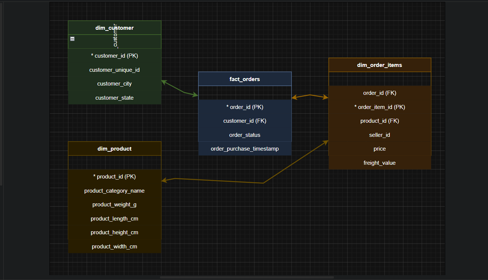
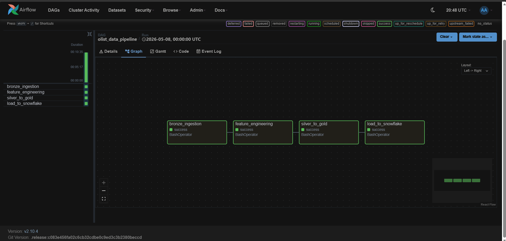
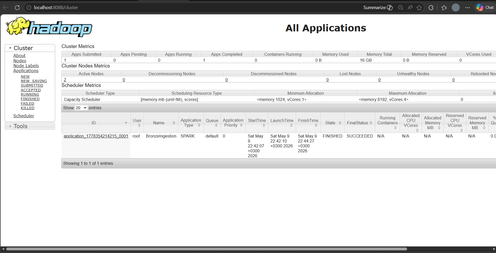
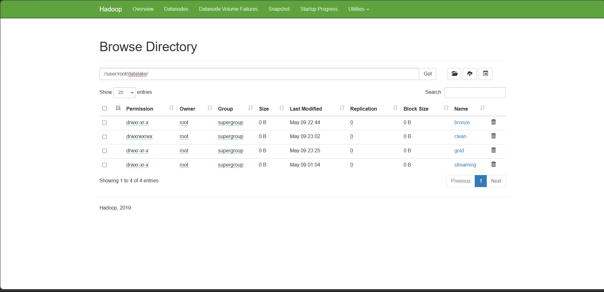
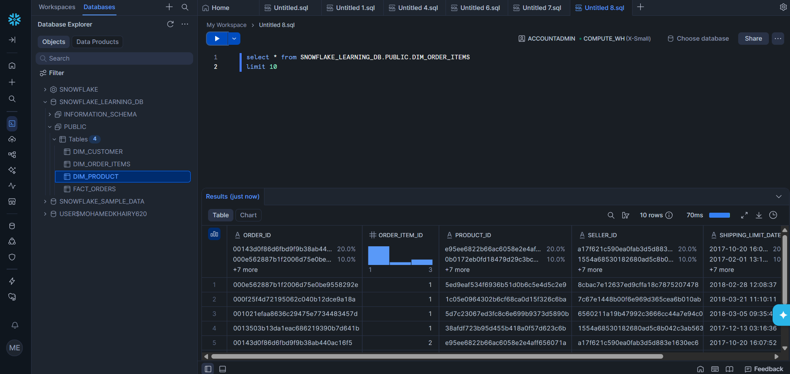

# Big Data ETL Pipeline using Spark, Hadoop, Airflow, and Snowflake

This project demonstrates an end-to-end Big Data ETL Pipeline for processing large-scale e-commerce data using modern Data Engineering tools.

The pipeline automates the complete workflow from data generation to cloud data warehousing using a Medallion Architecture (Bronze, Silver, Gold).

---

# System Architecture


# Star Schema



The pipeline follows a scalable Lakehouse Architecture divided into multiple layers:


### Data Generation
A Python-based simulator generates mock e-commerce transaction data in JSON format.

### Data Ingestion (Bronze Layer)
Raw JSON files are ingested into Hadoop HDFS using Apache Spark.

### Data Processing (Silver Layer)
PySpark performs data cleaning, preprocessing, and feature engineering.

### Data Modeling (Gold Layer)
The processed data is transformed into a Star Schema model (Fact & Dimension tables) and stored as Parquet files.

### Cloud Loading
Final analytical tables are loaded into Snowflake Cloud Data Warehouse using the Spark Snowflake Connector.

### Workflow Orchestration
Apache Airflow automates and schedules the entire ETL pipeline.

---

# Pipeline Workflow

```text
Data Simulator
      │
      ▼
Raw JSON Data
      │
      ▼
Bronze Layer (HDFS)
      │
      ▼
Silver Layer (Feature Engineering)
      │
      ▼
Gold Layer (Star Schema)
      │
      ▼
Snowflake Data Warehouse
```

---

# Data Modeling (Star Schema)

The project uses a Star Schema optimized for analytical queries.

## Fact Table

- FACT_ORDERS

### Dimension Tables

- DIM_CUSTOMER
- DIM_PRODUCT
- DIM_ORDER_ITEMS

---

# Tech Stack

| Technology | Purpose |
|---|---|
| Python | Main programming language |
| Apache Spark | Distributed data processing |
| Hadoop HDFS | Distributed storage |
| Apache Airflow | Workflow orchestration |
| Snowflake | Cloud data warehouse |
| Docker | Containerization |
| PySpark | Spark API for Python |
| YARN | Cluster resource management |

---

# Airflow DAG Workflow

The pipeline is orchestrated using Apache Airflow with the following tasks:

1. Bronze Ingestion
2. Feature Engineering
3. Silver to Gold Transformation
4. Load to Snowflake


---

# Project Structure

```bash
project-root/
│
├── dags/
│
├── simulator/
│   └── data_generator.py
│
├── ingestion/
│   └── bronze_ingestion.py
│
├── transformation/
│   ├── feature_engineering.py
│   └── silver_to_gold.py
│
├── loading/
│   └── load_to_snowflake.py
│
├── jars/
│
├── notebooks/
│
├── data/
│
├── docker-compose.yml
│
└── README.md
```

---

# Final Validation

## Execution Status
- All Airflow tasks completed successfully.
- Spark jobs executed successfully on YARN.

## Data Validation
- Data successfully stored in HDFS.
- Gold Layer tables successfully loaded into Snowflake.
- Data quality checks completed successfully.

---

# Execution Screenshots

## 1. Airflow DAG Execution
Successful execution of the ETL workflow.



## 2. Hadoop & YARN Monitoring
Validation of Spark job execution on the cluster.



## 3. HDFS Storage
Verification of Bronze, Silver, and Gold layer storage.



## 4. Snowflake Validation
Final verification of loaded analytical tables in Snowflake.



---

# Author

## Mohamed Khairy

Computer Science Student  
Interested in Data Engineering, Machine Learning, and Big Data Systems.
